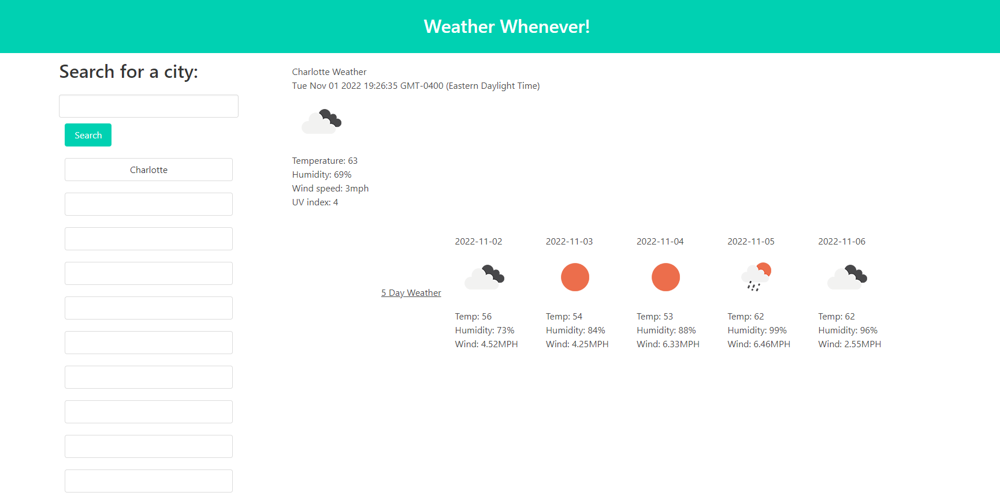

# Weather Whenever

  

  # Description
This is a weather dashboard that is able to give you the current weather for the city of your choice alongside the weather for the next 5 days. This utilizes the [Weather API](https://openweathermap.org/forecast5) to retrieve weather data for cities.  

An image of the WebPage can be found below!  

  # Questions
  If you have any questions about the repository, please contact/email benny.le890@gmail.com  
  My GitHub profile is found at [GitHub Profile](https//GitHub.com/bennyle890)
